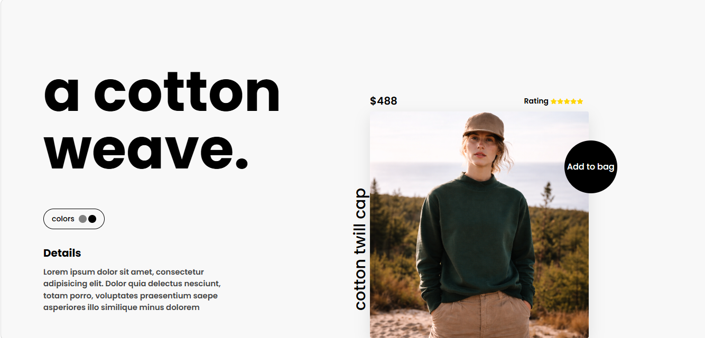
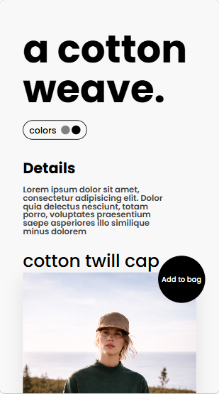
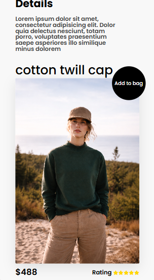

# Cotton Weave Product Page

This is a modern fashion product landing page built using HTML and CSS.
The project focuses on clean UI design, responsive layouts, modern typography, hover interactions, and creative product showcase sections.

## Features

* Responsive product landing page
* Modern minimal UI
* Interactive hover effects
* Stylish product showcase layout
* Circular “Add to Bag” button
* Rotated product title effect
* Clean typography using Google Fonts
* Product rating section
* Smooth image hover animations
* Mobile responsive design

## Technologies Used

* HTML5
* CSS3
* Font Awesome
* Google Fonts
* Git & GitHub

## Folder Structure

```bash
cotton-weave-product-page/
├── index.html
├── style.css
├── README.md
│
├── Images/
│   ├── Image.png
│   ├── desktop-preview.png
│   ├── mobile-preview-1.png
│   └── mobile-preview-2.png
```

## Screenshots

### Desktop View



### Mobile View



### Product Section



## How to Run

1. Clone the repository:

```bash
git clone https://github.com/kenil948/cotton-weave-product-page.git
```

2. Open `index.html` in your browser.

## Live Demo

Check it out here:
https://kenil948.github.io/cotton-weave-product-page/

## What I Learned

* Responsive Web Design
* Flexbox Layout Structuring
* CSS Positioning
* Hover Animations
* Modern Typography Usage
* Product UI Designing
* Media Queries
* UI Spacing & Alignment
* GitHub Project Structuring
* Creating Interactive Frontend Layouts

## Notes

This is a frontend practice project created for improving UI/UX and frontend development skills.
